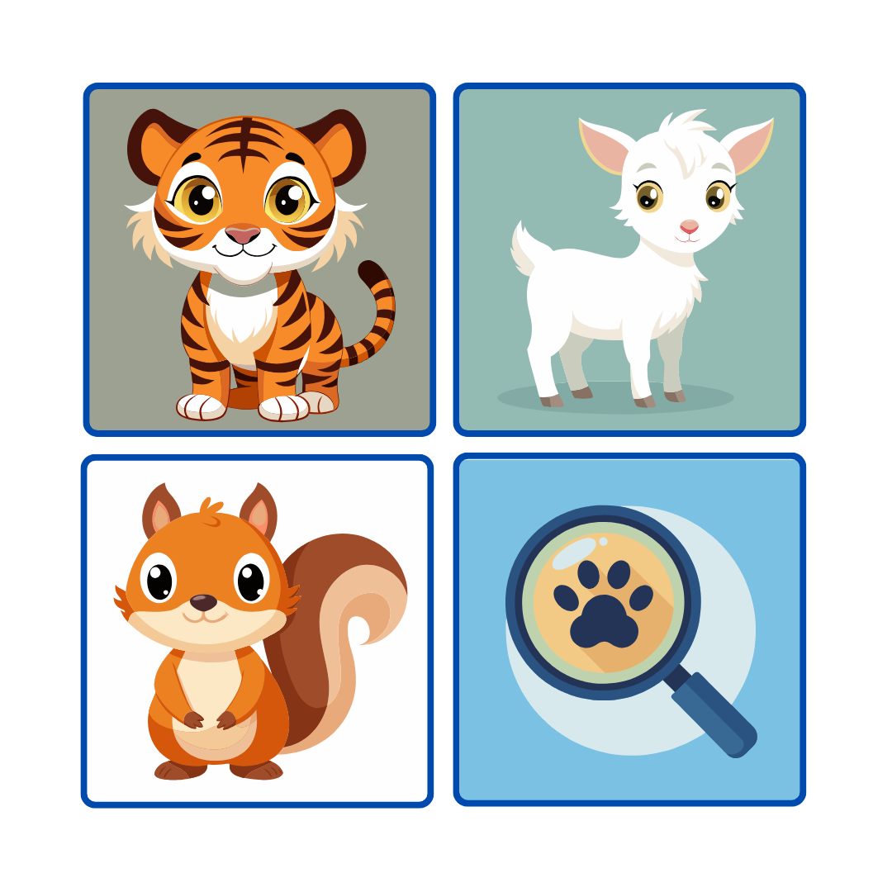
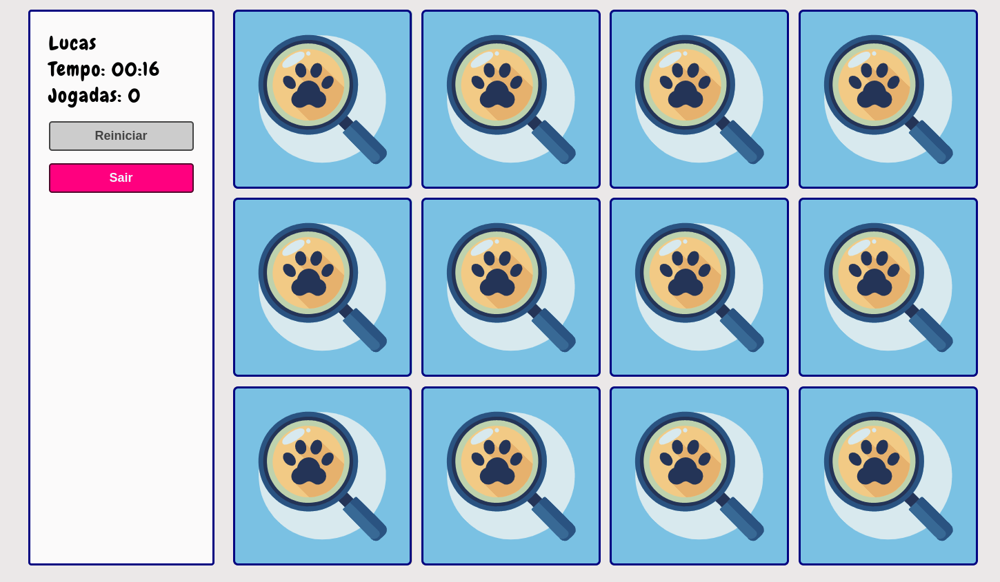
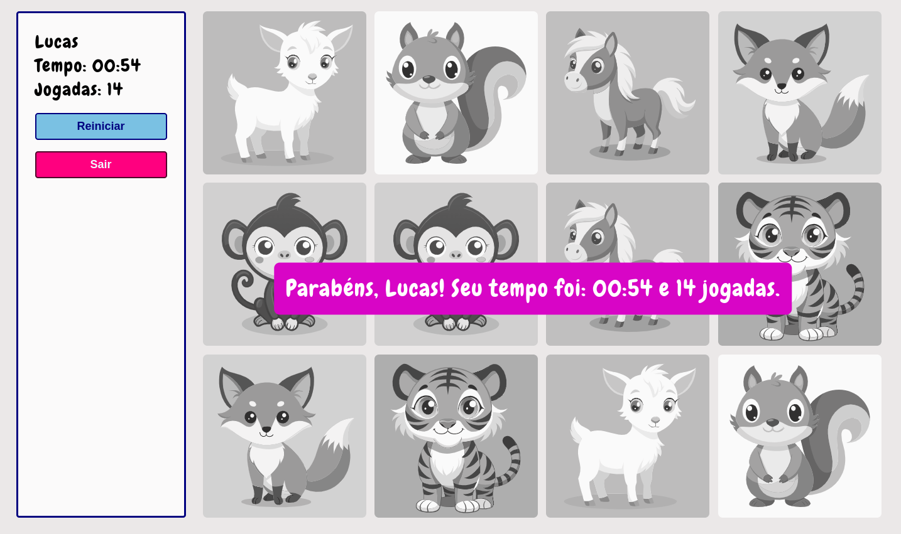
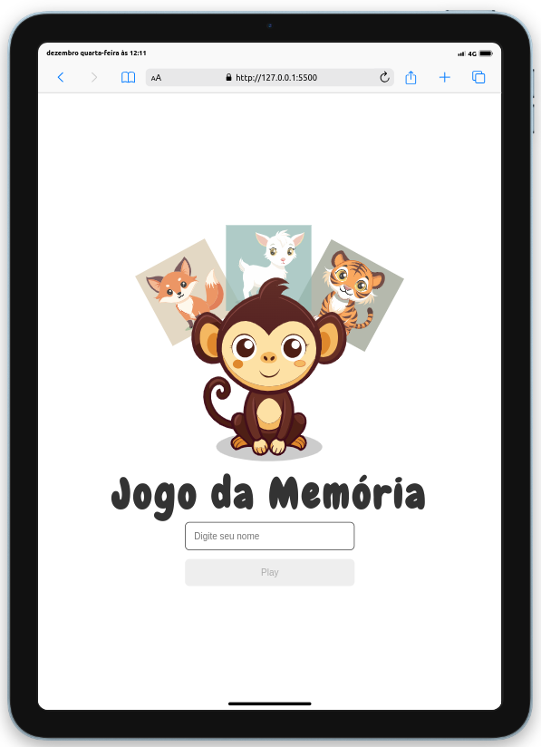
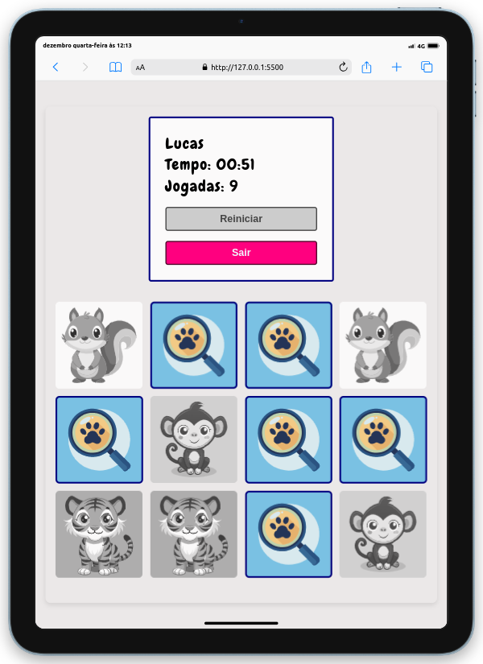

# Jogo da Memória

Este é um jogo da memória desenvolvido em JavaScript, que utiliza ilustrações geradas por inteligência artificial para os cards. O jogo é simples, divertido e perfeito para treinar sua memória enquanto aprecia artes visuais criativas!

## Recursos

- **Cards personalizados**: Cada card apresenta uma ilustração única gerada por IA.
- **Responsividade**: O jogo funciona bem em dispositivos desktop e móveis.
- **Interatividade**: Animações suaves ao virar os cards.
- **Pontuação**: Conta o número de jogadas e tempo de partida.

## Tecnologias Utilizadas

- **HTML5**: Estrutura do jogo.
- **CSS3**: Estilização e animações dos cards.
- **JavaScript**: Lógica do jogo.
- **Inteligência Artificial**: Geração das ilustrações.

## Como Jogar

1. **Abra o jogo**: Acesse o arquivo `index.html` em um navegador ou visite o link hospedado.
2. **Revele os cards**: Clique em dois cards para virá-los.
3. **Combine os pares**: Tente encontrar dois cards com a mesma ilustração.
4. **Complete o jogo**: Encontre todos os pares no menor número de jogadas possível!

## Capturas de Tela

<p align="center">
  
  
  
  
  
  
</p>


## Como Executar Localmente

1. Clone o repositório:
   ```bash
   git clone https://github.com/seu-usuario/jogo-da-memoria.git
   ```
2. Navegue até o diretório do projeto:
   ```bash
   cd jogo-da-memoria
   ```
3. Abra o arquivo `index.html` em seu navegador.

## Contribuições

Contribuições são bem-vindas! Siga os passos abaixo para colaborar:

1. Faça um fork do repositório.
2. Crie uma branch para sua contribuição:
   ```bash
   git checkout -b minha-contribuicao
   ```
3. Submeta suas alterações e crie um pull request.

## Licença

Este projeto está licenciado sob a [MIT License](LICENSE).


